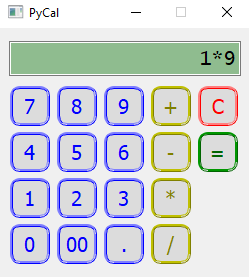

# Calculator

* This is a caluclator created using:
    * Model View Control design pattern and OOP concepts
    * PyQT5 library
* To start the calculator:
  * Install `PyQt5` library
  * Run `.\src\main.py`
  

